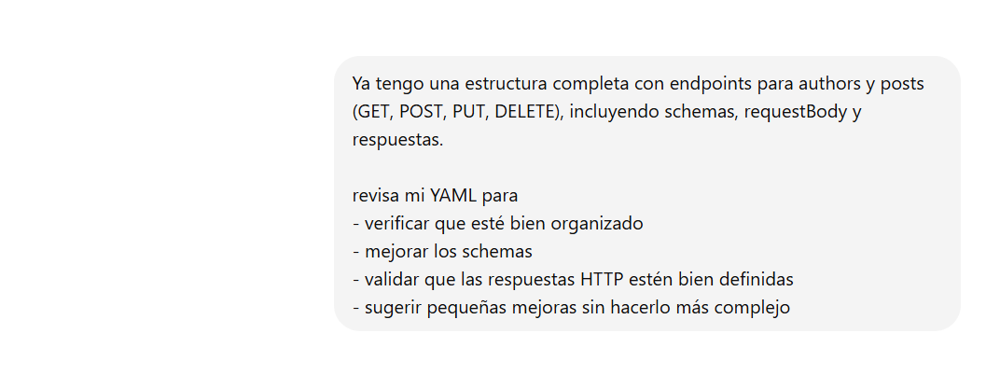
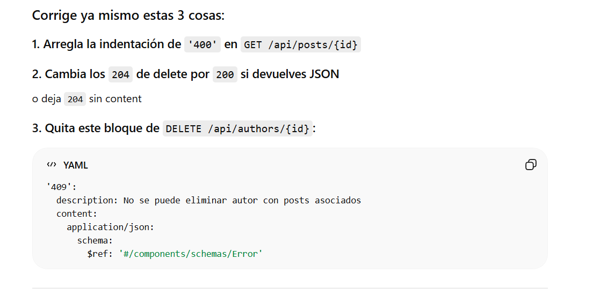
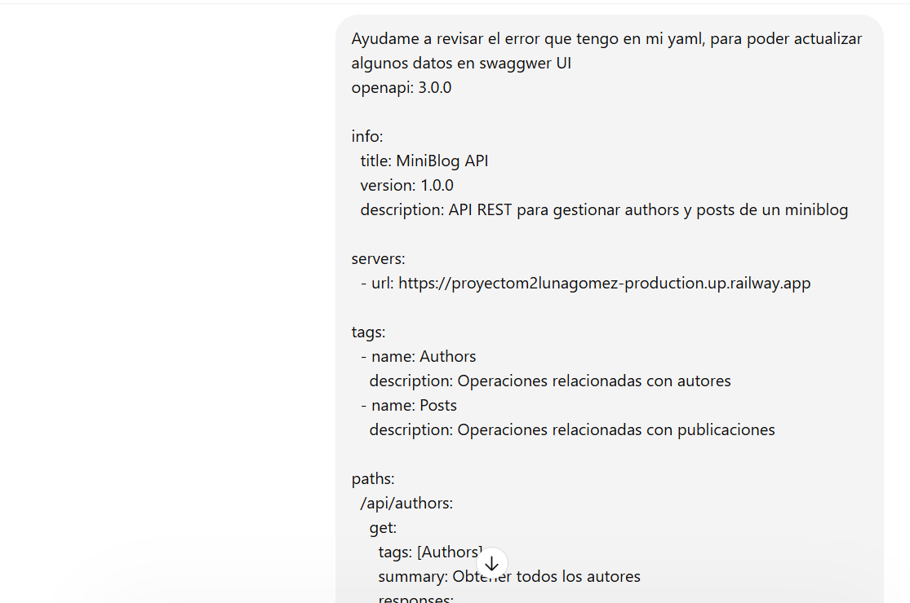
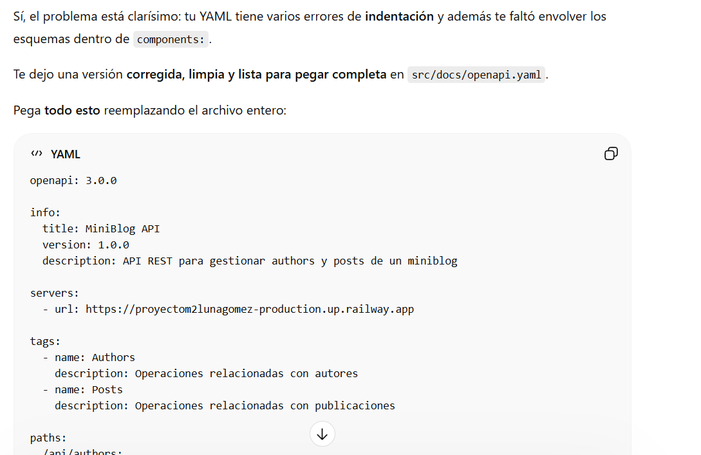
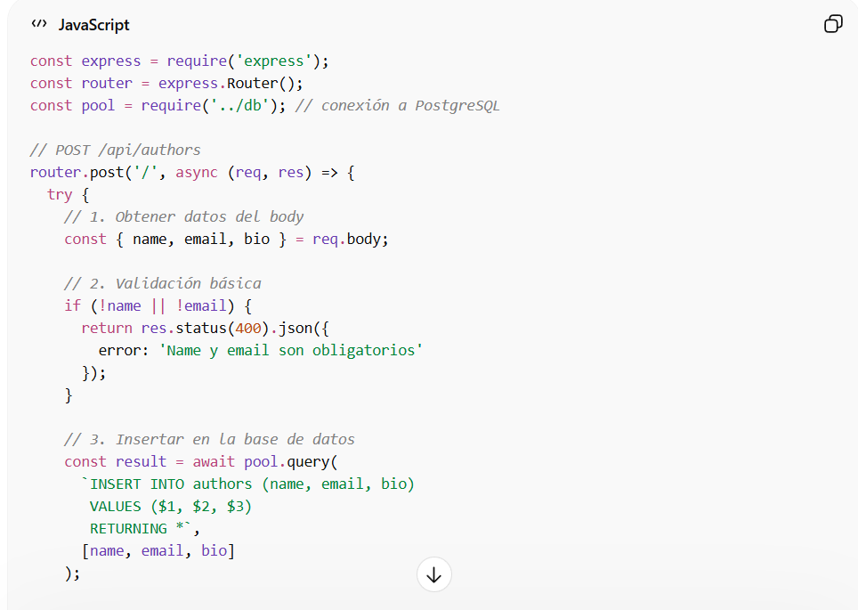
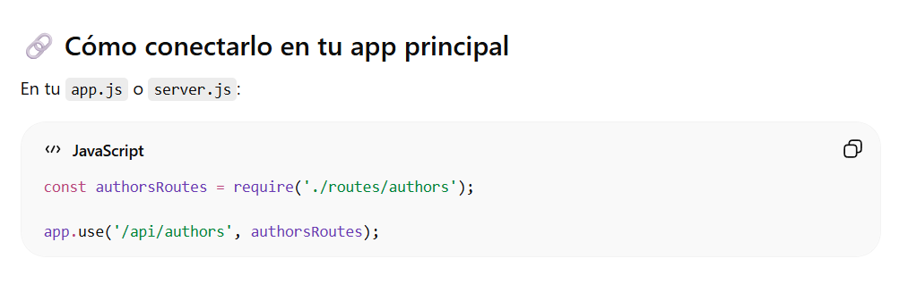
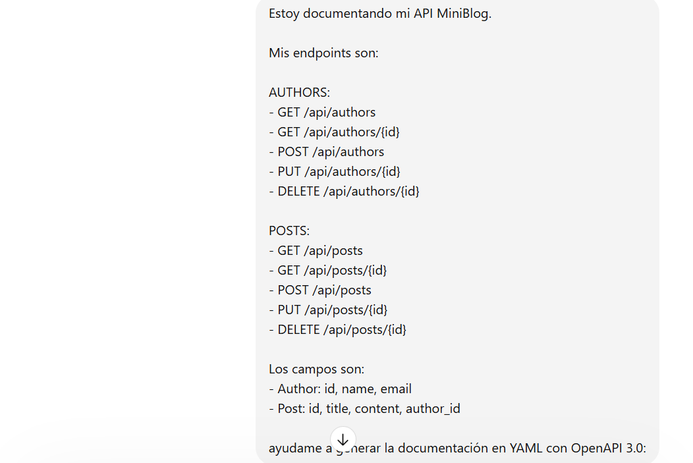
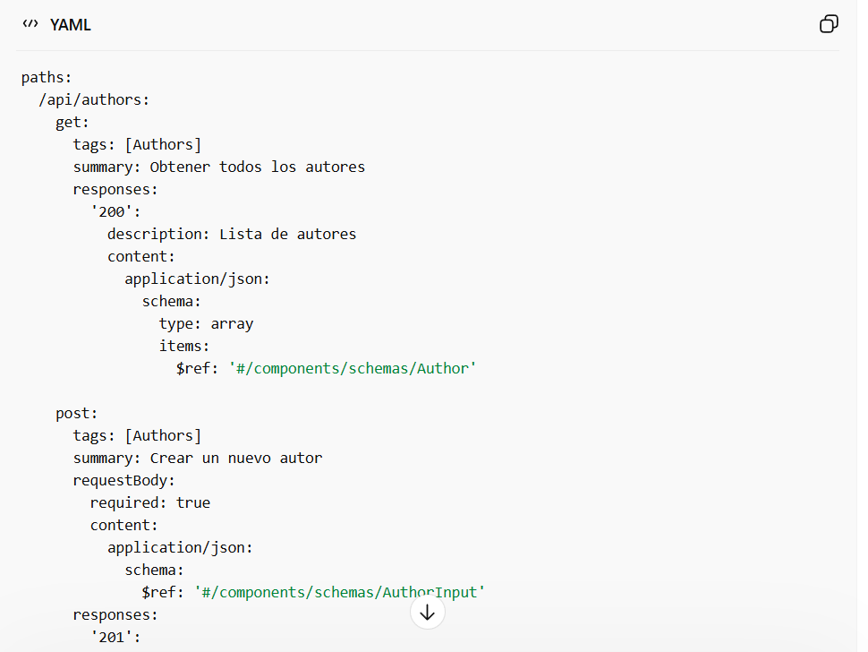
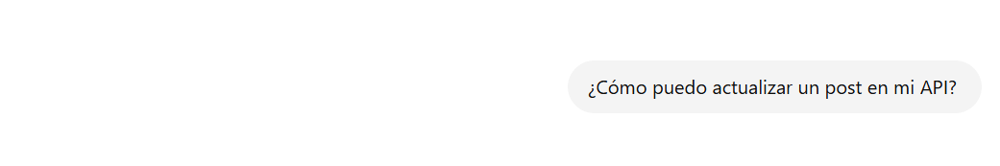
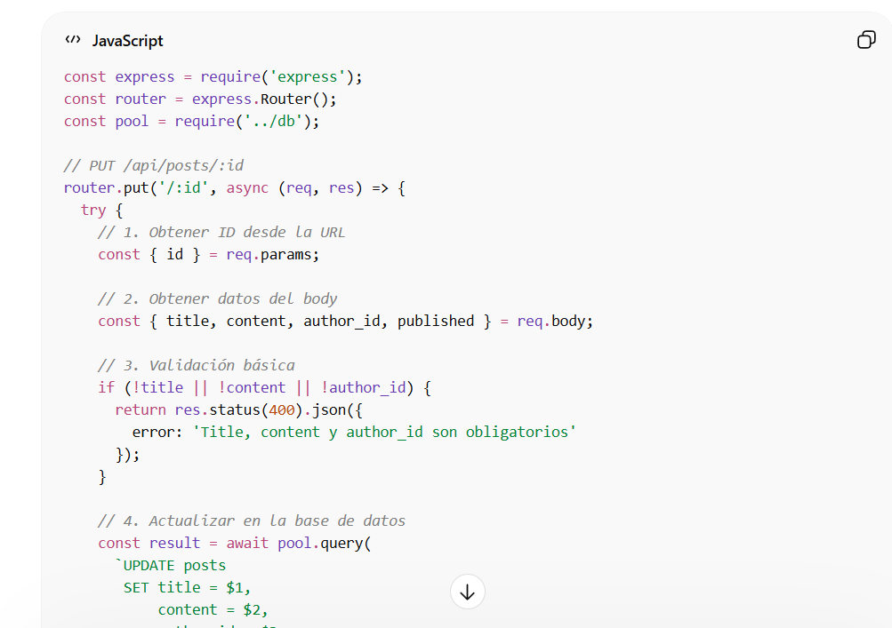

# 🚀 MiniBlog API - DevSpark

API REST desarrollada en **Node.js + Express** para gestionar autores y publicaciones (posts).  
Permite crear, consultar, actualizar y eliminar información almacenada en **PostgreSQL**, incluyendo validaciones y documentación interactiva.

---

## 🌐 URL de la API

API desplegada en Railway:
https://proyectom2lunagomez-production.up.railway.app


---

## 📚 Documentación interactiva (Swagger)

OpenAPI disponible en:
https://proyectom2lunagomez-production.up.railway.app/api-docs


Desde esta interfaz se pueden probar todos los endpoints directamente desde el navegador.

---

## 🛠 Tecnologías utilizadas

- Node.js  
- Express.js  
- PostgreSQL  
- OpenAPI (Swagger)  
- Railway (Deployment)  
- Postman (Testing)

---

## 📡 Endpoints disponibles

### 👩‍💻 Authors

| Método | Endpoint | Descripción |
|--------|--------|------------|
| GET | /api/authors | Obtener todos los autores |
| GET | /api/authors/:id | Obtener autor por ID |
| POST | /api/authors | Crear un nuevo autor |
| PUT | /api/authors/:id | Actualizar un autor |
| DELETE | /api/authors/:id | Eliminar un autor |

---

### 📝 Posts

| Método | Endpoint | Descripción |
|--------|--------|------------|
| GET | /api/posts | Obtener todos los posts |
| GET | /api/posts/:id | Obtener post por ID |
| GET | /api/posts/author/:authorId | Obtener posts por autor |
| POST | /api/posts | Crear un post |
| PUT | /api/posts/:id | Actualizar un post |
| DELETE | /api/posts/:id | Eliminar un post |

---

## 💻 Ejemplos de uso

### 📌 Crear un autor

```json
{
  "name": "Gabriel García Márquez",
  "email": "gabriel@email.com",
  "bio": "Escritor colombiano"
}
```

### 📌 Crear un post

```json
{
  "title": "Cien años de soledad",
  "content": "Novela literaria latinoamericana.",
  "author_id": 1,
  "published": true
}
```

## 🚀 Deployment en Railway

### 1️⃣ Crear el proyecto

- Ir a https://railway.app  
- Crear un nuevo proyecto  
- Conectar el repositorio de GitHub  

---

### 2️⃣ Variables de entorno

Railway genera automáticamente las variables, pero debes verificar:

```env
DATABASE_URL=
PORT=
NODE_ENV=production
```

### 3️⃣ 🌐 URL pública

https://proyectom2lunagomez-production.up.railway.app

---

### 4️⃣ Deploy automático

Cada vez que haces:

```bash
git push
```
## ⚙️ Instalación local

### 1️⃣ Clonar el repositorio

```bash
git clone https://github.com/TU-USUARIO/TU-REPO.git
```

### 2️⃣ Instalar dependencias

```bash
npm install
```

### 3️⃣ Configurar variables de entorno

Crear archivo `.env`:

```env
DATABASE_URL=
PORT=3000
NODE_ENV=development
```

### 4️⃣ Ejecutar servidor

```bash
npm start

Servidor disponible en:
http://localhost:3000
```

## Pruebas de la API con Postman

Para verificar el funcionamiento de los endpoints se utilizó **Postman**, una herramienta que permite enviar solicitudes HTTP y analizar las respuestas del servidor de manera sencilla.

---

### 1️⃣ Instalación de Postman

Descargar la herramienta desde el sitio oficial:  
https://www.postman.com/downloads/  

Una vez instalada, abrir la aplicación.

---

### 2️⃣ Crear una solicitud

- Abrir Postman  
- Seleccionar **New Request**  
- Elegir el método HTTP (GET, POST, PUT o DELETE)  
- Escribir la URL del endpoint  

Ejemplo:

https://proyectom2lunagomez-production.up.railway.app/api/authors

---

### 3️⃣ Consulta de autores (GET)

Para obtener todos los autores registrados:

**Método:** GET  
**Endpoint:**


https://proyectom2lunagomez-production.up.railway.app/api/authors

Luego hacer clic en **Send**.

**Ejemplo de respuesta:**

```json
[
  {
    "id": 1,
    "name": "Gabriel García Márquez",
    "email": "gabriel@email.com",
    "bio": "Escritor colombiano",
    "created_at": "2026-03-13T10:00:00.000Z"
  }
]
```

### 4️⃣ Creación de un autor (POST)

Para registrar un nuevo autor en la base de datos:

**Método:** POST  
**Endpoint:**
https://proyectom2lunagomez-production.up.railway.app/api/authors

Ir a la pestaña **Body → raw → JSON** y enviar:

```json
{
  "name": "Autor ejemplo",
  "email": "ejemplo@test.com",
  "bio": "Autor creado para pruebas de la API"
}
```

Presionar Send.

Respuesta esperada:

```json
{
  "id": 2,
  "name": "Autor ejemplo",
  "email": "ejemplo@test.com",
  "bio": "Autor creado para pruebas de la API",
  "created_at": "2026-03-13T10:10:00.000Z"
}
```

### 5️⃣ Otros endpoints disponibles

También se pueden probar diferentes funcionalidades de la API como:

- Consultar un autor por ID  
- Actualizar la información de un autor  
- Eliminar un autor  
- Crear y consultar publicaciones (posts)  

Ejemplos de endpoints:

- GET /api/posts
- GET /api/posts/{id}
- POST /api/posts
- PUT /api/posts/{id}
- DELETE /api/posts/{id}

---

### 6️⃣ Validación de resultados

Al enviar cada solicitud, Postman permite observar:

- Código de estado HTTP (200, 201, 400, 404, etc.)  
- Tiempo de respuesta del servidor  
- Contenido de la respuesta en formato JSON  

Esto facilita comprobar que los endpoints funcionan correctamente y que la API responde de manera adecuada

## Uso de IA

Se utilizo ChatGPT para resolver errores durante el desarrollo,
generar ejemplos de endpoints y apoyar la documentación del proyecto












